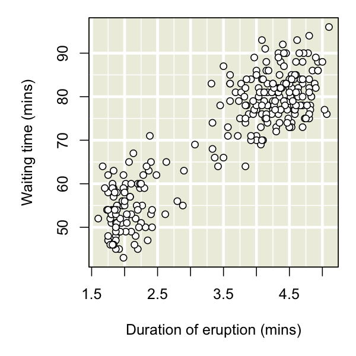
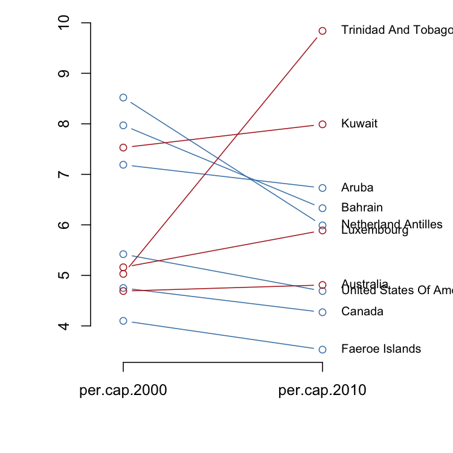

<!-- README.md is generated from README.Rmd. Please edit that file -->
ggfree: ggplot2-style plots with just base R graphics
=====================================================

[ggplot2](https://ggplot2.tidyverse.org/) is a popular R graphics package that is becoming synonymous with data visualization in R. The community of developers working within the ggplot2 framework have implemented some [rather nice extensions](https://www.ggplot2-exts.org/gallery/) as well. However, I personally find the ggplot2 syntax to be confusing, most probably because I've been using the base graphics package in R to generate plots for over a decade. I seldom see a ggplot2-based visualization that couldn't also be implemented in base graphics.

The overall purpose of `ggfree` is to make it easier to generate plots in the style of [ggplot2](https://ggplot2.tidyverse.org/) and its extensions, without ever actually using any ggplot2 code.

Installation
------------

For the time being, the simplest method is to use the `devtools` package:

``` r
# install.packages('devtools')  # if you haven't already installed devtools
require(devtools)
devtools::install_github("ArtPoon/ggfree")
```

(You could also simply copy-paste the functions you want to use into your R script.)

Examples
--------

### Fancy gridlines

The major and minor gridlines on a shaded background is one of the distinctive features of the default ggplot2 theme. This implementation uses `rect` and `abline` to obtain the same look.

``` r
require(ggfree)
#> Loading required package: ggfree
# prepare the plot region
plot(NA, xlim=range(faithful$eruptions), ylim=range(faithful$waiting),
     xlab='Duration of eruption (mins)', ylab='Waiting time (mins)')
add.grid()  # <-- a ggfree function!
points(faithful$eruptions, faithful$waiting, pch=21, bg='white')
```



We can also vary the colours, turn off major or minor gridlines, or skip vertical or horizontal lines:

``` r
plot(NA, xlim=range(faithful$eruptions), ylim=range(faithful$waiting),
     xlab='Duration of eruption (mins)', ylab='Waiting time (mins)')
# now with non-default arguments!
add.grid(mode='x', bg.col='seashell2', lwd.minor=0)
points(faithful$eruptions, faithful$waiting, pch=21, bg='white')
```



### Slopegraphs

A slopegraph is a method for visually comparing a paired set of observations.
