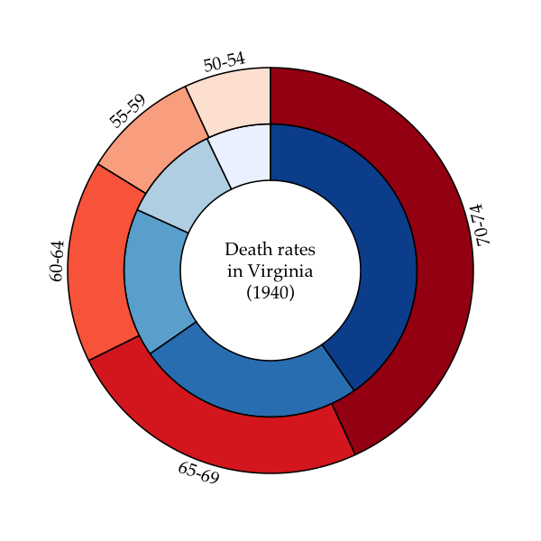
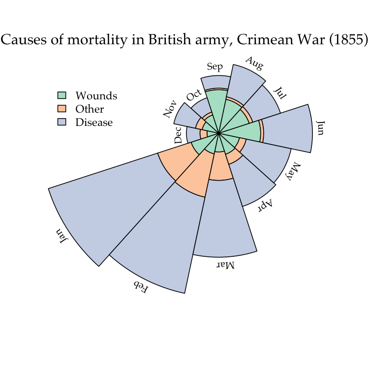

<!-- README.md is generated from README.Rmd. Please edit that file -->
ggfree: ggplot2-style plots with just base R graphics
=====================================================

[ggplot2](https://ggplot2.tidyverse.org/) is a popular R graphics package that is becoming synonymous with data visualization in R. The community of developers working within the `ggplot2` framework have implemented some [rather nice extensions](https://www.ggplot2-exts.org/gallery/) as well. However, it is almost always possible for a visualization produced in `ggplot2` to also be generated using the base graphics package in R. Long-time users of R who are accustomed to building plots with the latter may find the syntax of `ggplot2` counter-intuitive and awkward.

The overall purpose of `ggfree` is to make it easier to generate plots in the style of [ggplot2](https://ggplot2.tidyverse.org/) and its extensions, without ever actually using any ggplot2 code.

Installation
------------

For the time being, the simplest method is to use the `devtools` package:

``` r
# install.packages('devtools')  # if you haven't already installed devtools
require(devtools)
devtools::install_github("ArtPoon/ggfree")
```

(You could also simply copy-paste the functions you want to use into your R script.)

Examples
--------

### Fancy gridlines

The major and minor gridlines on a shaded background is one of the distinctive characteristics of the default `ggplot2` theme. This implementation uses `rect` and `abline` to obtain the same look.

``` r
require(ggfree)
#> Loading required package: ggfree
# prepare the plot region
plot(NA, xlim=range(faithful$eruptions), ylim=range(faithful$waiting),
     xlab='Duration of eruption (mins)', ylab='Waiting time (mins)')
add.grid()  # <-- a ggfree function!
points(faithful$eruptions, faithful$waiting, pch=21, bg='white')
```


We can also vary the colours, turn off major or minor gridlines, or skip vertical or horizontal lines:

``` r
plot(NA, xlim=range(faithful$eruptions), ylim=range(faithful$waiting),
     xlab='Duration of eruption (mins)', ylab='Waiting time (mins)')
# now with non-default arguments!
add.grid(mode='x', bg.col='seashell2', lwd.minor=0)
points(faithful$eruptions, faithful$waiting, pch=21, bg='white')
```


### Slopegraphs

In general, a slopegraph is a method for visually comparing a paired set of observations. To illustrate the use of slopegraphs, I've adapted a carbon dioxide emissions data set similar to the one used by @clauswilke to demonstrate slopegraphs in *Fundamentals of Data Visualization*. This data sets is packaged with `ggfree`:

``` r
require(ggfree)
co2.emissions
#>                          per.cap.2000 per.cap.2010
#> Netherland Antilles              8.52         5.99
#> Bahrain                          7.97         6.33
#> Kuwait                           7.53         7.99
#> Aruba                            7.19         6.73
#> United States Of America         5.42         4.69
#> Luxembourg                       5.16         5.89
#> Trinidad And Tobago              5.03         9.84
#> Canada                           4.75         4.27
#> Australia                        4.69         4.81
#> Faeroe Islands                   4.10         3.53
```

There are two styles of slopegraphs that are implemented in `ggfree`. For the first style (where the argument `type` is left at its default value `'b'`), a vertical axis provides reference for the numerical values:

``` r
slopegraph(co2.emissions, colorize=T)
```

 Setting `colorize` to `TRUE` causes the line segments to be coloured to emphasize positive and negative slopes.

For the second style (setting `type='t'`), we substitute the raw numerical values for data points, which makes the vertical axis unnecessary:

``` r
par(family='Palatino')  # use a fancier font

# the actual code here
slopegraph(co2.emissions, type='t', cex.text=0.6, names.arg=c(2000, 2010))

# make a nice title
title(expression(text=paste('CO'[2], ' emissions (metric tons) per capita')), 
      cex=0.7)
```



### Ringplots

A ring- or donut-plot is simply a piechart with a hole in it. Piecharts have been criticized for being potentially misleading because it is difficult to compare the areas of two different sectors by eye. However, they are intuitive and compact visual devices, and multiple plots can be drawn in varying sizes to encode additional information, such as sample size. The additional advantages of ringplots is that information can be embedded in the middle of the plot as text, and multiple ringplots can be nested within each other to display hierarchical frequency data (these are sometimes known as "sunburst" plots).

To generate a ring-plot in `ggfree`, you need to pass a vector of numeric values and specify the inner and outer radii:

``` r
# prepare colour palettes
require(RColorBrewer)
#> Loading required package: RColorBrewer
pal1 <- brewer.pal(5, 'Blues')
pal2 <- brewer.pal(5, 'Reds')
 
# calling ringplot without x, y args makes new plot
ringplot(VADeaths[,1], r0=0.4, r1=0.65, col=pal1)

# called with x, y args adds ring to existing plot;
# setting use.names to TRUE adds labels
ringplot(VADeaths[,2], x=0, y=0, r0=0.65, r1=0.9, col=pal2, 
use.names=T, offset=0.05, srt=90)

# write a label in the middle
text(x=0, y=0, adj=0.5, label='Death rates\nin Virginia\n(1940)', cex=0.8)
```


### Polar area charts

A polar area chart is similar to a ringplot, except that the sectors corresponding to different levels of a factor are drawn at regular angles from the centre. Instead, the frequencies of the respective levels are visualized by scaling the *area* of the annular sector (donut slice).

To illustrate, we're going to reproduce the classic plot by [Florence Nightingale](https://en.wikipedia.org/wiki/Pie_chart#Polar_area_diagram):

``` r
pal <- brewer.pal(3, 'Pastel2')

# load the Florence Nightingale data set (note, need to install HistData)
require(HistData)
#> Loading required package: HistData
ng <- subset(Nightingale, Year==1855, c('Wounds.rate', 'Other.rate', 'Disease.rate'))
row.names(ng) <- Nightingale$Month[Nightingale$Year==1855]

par(mar=rep(0,4))
# the actual plotting function
polarplot(as.matrix(ng), x=0.2, y=0.3, theta=1.1*pi, col=pal, 
use.names=T)

# add some nice labels
title('Causes of mortality in British army, Crimean War (1855)', 
      font.main=1, family='Palatino', line=-3)
legend(x=-0.8, y=0.6, legend=c('Wounds', 'Other', 'Disease'), bty='n', 
       fill=pal, cex=0.9)
```


### Ridgeplots

Ridgeplots are basically stacked [kernel densities](https://en.wikipedia.org/wiki/Kernel_density_estimation). Displacing each density curve a small amount along the vertical axis can make it easier to distinguish one curve from another. The end result can also resemble a topographical map, which is likely the etymology of the name for this type of plot.

In this example, we're going to make use of the `add.alpha` function in `ggfree:common` that adds transparency to colour specifications in R:

``` r
par(mar=c(5,5,1,1))
pal <- add.alpha(brewer.pal(3, 'Set1'), 0.5)
ridgeplot(split(iris$Sepal.Length, iris$Species), step=0.4, col='white', 
fill=pal, lwd=2, xlab='Sepal length', cex.lab=1.2)
```


