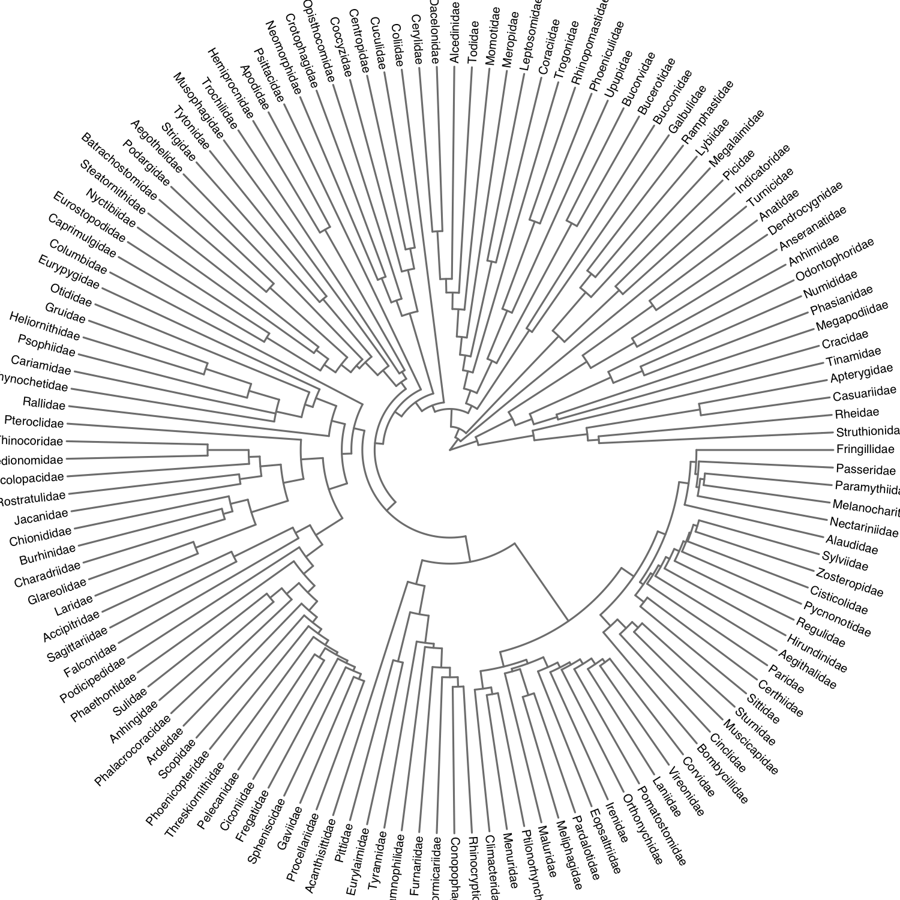

Plotting trees with ggfree
================

The [ggtree](https://github.com/YuLab-SMU/ggtree) package by Guangchuang
Yu is an excellent resource for drawing information-rich visualizations
of phylogenetic trees. (See
<https://guangchuangyu.github.io/software/ggtree/gallery/> for a gallery
of figures generated using `ggtree`.) `ggtree` employs the same grammar
as `ggplot`, so writing code looks quite similar:

``` r
# load the package without all the preamble
suppressMessages(require(ggtree))

# generate a random tree
set.seed(1999); phy <- rtree(50)

# draw the tree gg-style!
ggtree(phy) + theme_tree2() + geom_tiplab(size=3)
```


Since I am accustomed to base R, however, I find this syntax unfamiliar
and frustrating, and was motivated to start implementing similar plot
functions in `ggfree`. Of course there are several other packages in R
that provide plotting functions for phylogenetic tree objects. For
example, the
[ape](https://cran.r-project.org/web/packages/ape/index.html) package —
which defines the `phylo` [S3 object](http://adv-r.had.co.nz/S3.html)
class that many packages for phylogenetics will accept as inputs —
adapts the generic S3 `plot` function for trees (called `plot.phylo`).
However, it is not straight-forward to annotate the resulting plot with
additional information, such as highlighting a subset of internal nodes.
This is because there are two things happening when we call
`plot.phylo`:

1.  the method maps the nodes and edges (branches) of the tree to the
    `x` and `y` coordinates according to one of several layout
    algorithms, and;

2.  the method draws the tree on these coordinates in the active plot
    device.

Consequently, the `x` and `y` coordinates are not readily available for
the user to add additional information to the plot. (I’ll demonstrate
why it’s nice to have access to these data in subsequent sections.)

`ggfree` separates these tasks into different functions. Generating the
coordinates for a given layout algorithm is handled by the function
`tree.layout`, which returns an [S3
object](http://adv-r.had.co.nz/S3.html) that I call `phyloLayout`.

``` r
require(ggfree)
#> Loading required package: ggfree
#> Loading required package: ape
#> 
#> Attaching package: 'ape'
#> The following object is masked from 'package:ggtree':
#> 
#>     rotate
#> 
#> Attaching package: 'ggfree'
#> The following object is masked from 'package:ape':
#> 
#>     unroot
L <- tree.layout(phy)
plot(L)
axis(side=1)  # add a horizontal axis like ggtree example
```


There are clearly some differences here. For instance, the order of tips
is different because `ggtree` has automatically ladderized the phylogeny
by default. We can amend this using the `ape:ladderize` function:

``` r
phy2 <- ladderize(phy, right=F)
plot(tree.layout(phy2), col='black', lwd=1, cex=0.75, mar=c(2,0,0,0))
axis(side=1, cex.axis=0.75, mgp=c(3,0.5,0))
```


Note that I’ve also added some other basic R graphical parameters to
make the plot more similar to the `ggtree` example. A lot of this code
is tucked into the `ggtree` function

### `phyloLayout` objects

Let’s have a look at what’s getting returned when we call `tree.layout`:

``` r
L <- tree.layout(phy2)
L  # calls print.phyloLayout function
#> Phylogenetic layout using a rectangular algorithm
#>  with 50 tips and 49 internal nodes.
#> 
#> $nodes (99 nodes with 4 attributes):
#>   label n.tips        x  y
#> 1   t40      0 3.032877 22
#> 2   t17      0 2.763512 23
#> 3   t49      0 3.252531 24
#> 4   t12      0 3.039627 25
#> 5   t27      0 6.064988 46
#> 6   t10      0 6.747390 47
#> 
#> $edges (98 edges with 8 attributes):
#>   parent child     length isTip        x0        x1       y0       y1
#> 1     51    87 0.91742815 FALSE 0.0000000 0.9174281 4.484375 4.484375
#> 2     87    88 0.98563767 FALSE 0.9174281 1.9030658 1.750000 1.750000
#> 3     88    37 0.50608669  TRUE 1.9030658 2.4091525 1.000000 1.000000
#> 4     88    89 0.54734647 FALSE 1.9030658 2.4504123 2.500000 2.500000
#> 5     89    38 0.49303928  TRUE 2.4504123 2.9434516 2.000000 2.000000
#> 6     89    39 0.08740325  TRUE 2.4504123 2.5378155 3.000000 3.000000
```

Here we can see that a `phyloLayout` object contains two data frames for
the nodes and edges of the tree, respectively. (Only the first six rows
of each are being displayed because this `print` function is calling
`head` for each data frame.) The `nodes` data frame contains x and y
coordinates, and the `edges` data frame contains two sets of x and y
coordinates. In addition, any node- or edge-level attributes that you
happened to attach to the original `phylo` object are automatically
carried over to these data frames. These are the main outputs of the
layout algorithm.

### Layout algorithms

`ggfree` provides three popular layout algorithms for phylogenetic
trees. We specify which layout algorithm we want to use by passing a
`type` argument to the function `tree.layout`:

1.  **Rectangular/slanted trees.** The above trees have been plotted
    using a rectangular layout. The horizontal lines (branches)
    represent the amount of time or expected amount of evolution along
    each lineage. By convention, time “flows” forward from the left to
    right of the figure. The vertical lines are only used to connect
    linegaes to their common ancestors and to separate lineages in the
    vertical dimension - their lengths do not represent any information.
    
    A slanted tree uses the same coordinate information as a rectangular
    layout, except that lineages are connected directly to their
    ancestral nodes without vertical line
    segments:
    
    ``` r
    plot(tree.layout(phy, type='s', unscaled=TRUE), cex=0.5, mar=c(0,0,0,3))
    ```
    
    

2.  **Circular (radial) trees.** This is essentially the rectangular
    layout algorithm in a polar coordinate system. Time flows outward
    from the origin (centre) of the
    plot.
    
    ``` r
    plot(tree.layout(phy, type='o'))
    ```
    
    

3.  **Unrooted trees.** Like many other R packages that provide plot
    functions for trees, `ggtree` implements [Joe
    Felsenstein’s](https://en.wikipedia.org/wiki/Joseph_Felsenstein)
    equal-angle layout algorithm for unrooted trees. Note that I’ve
    turned off tip labels because they become cluttered in this
    layout:
    
    ``` r
    plot(tree.layout(phy, type='u'), label='n', mar=c(0,0,0,0))
    ```
    
    

## Annotating nodes

## Example: Influenza tree from `ggtree`

To demonstrate how we can reproduce plots generated by `ggtree` with
base R graphics, I’ve taken the example data sets from the `ggtree`
distribution
(<https://github.com/YuLab-SMU/ggtree/blob/master/inst/examples/>) and
reprocessed them using base R, with the exception of `read.nexus` from
the `ape` package:

``` r
# read maximum clade credibility tree
flu <- read.nexus('MCC_FluA_H3.tree')

# extract dN/dS ratios from text file
mlc <- readLines('mlc.txt')
nwk <- mlc[ which(grepl("w ratios", mlc)) + 1 ]
nwk <- gsub("#", ":", nwk)
nwk <- gsub(" ", "", nwk)
dnds <- read.tree(text=nwk)

# annotate flu tree with dN/dS outcomes
flu <- ladderize(flu, right=F)
dnds <- ladderize(dnds, right=F)
flu$dnds <- dnds$edge.length

# export the result for loading with `ggfree`
save(flu, file="flu.RData")
```

Here is the example code from `ggtree` to draw the phylogeny annotated
with host species and genotype (with a
heatmap):

``` r
cols <- scale_color(merged_tree, "dN_vs_dS", low="#0072B2", high="#D55E00",
interval=seq(0, 1.5, length.out=100))
p <- ggtree(merged_tree, size=.8, mrsd="2013-01-01", ndigits = 2, color=cols)
p <- add_colorbar(p, cols, font.size=3)

## add annotation of clade posterior and colored in darkgreen
p <- p + geom_text(aes(label=posterior), color="darkgreen", vjust=-.1,
hjust=-.03, size=1.8)

## add annotation of amino acid substitution inferred by joint probabilities
p <- p + geom_text(aes(x=branch, label=joint_AA_subs), vjust=-.03, size=1.8)

## get the tip labels
tip <- get.tree(merged_tree)$tip.label

## create a new data.frame containing information of host species.
host <- rep("Human", length(tip))
host[grep("Swine", tip)] <- "Swine"
host.df <- data.frame(taxa=tip, host=factor(host))

## use %<+% operator to attach the information to the tree view
p <- p %<+% host.df

## add circles in tips and tip labels align to the right hand side.
## after the attachment via %<+% operator,
## we can use 'host' information to color circles and labels of tips.
p <- p + geom_tippoint(aes(color=host), size=2) +
geom_tiplab(aes(color=host), align=TRUE, size=3, linesize=.3)

## rescale the color to blue (for human) and red (for swine)
p <- p + scale_color_manual(values = c("#377EB8", "#E41A1C"), guide='none')

## setting the coordinate system
p <- p + theme_tree2() + scale_y_continuous(expand=c(0, 0.6)) + xlab("Time")

## setting size of axis text and title.
p <- p + theme(axis.text.x=element_text(size=10), axis.title.x =
element_text(size=12))
p <- gheatmap(p, genotype, width=.4, offset=7, colnames=F) %>% scale_x_ggtree
p <- p + scale_fill_brewer(palette="Set2")
p <- p+theme(legend.text=element_text(size=8), legend.key.height=unit(.5,
"cm"),
legend.key.width=unit(.4, "cm"),
legend.position=c(.13, y=.945))
```

Note that I’ve omitted some of the code for loading and reformatting the
data for brevity and for a more equitable comparison to `ggfree` syntax.

``` r
L <- tree.layout(flu, 'r')
plot(L, cex=0.6, type='n', mar=c(3,1,0,20), label='n')

# map dN/dS values to colours
pal <- colorRampPalette(c('#0072B2', '#D55E00'))(20)
breaks <- c(seq(0, 1.5, length.out=19), 1000)
col <- pal[as.integer(cut(L$edges$dnds, breaks=breaks))]

# draw labels
host <- ifelse(grepl('Swine', L$nodes$label), '#E41A1C', '#377EB8')
text(L, align=TRUE, cex=0.75, col=host)

# draw tree
lines(L, col=col, lwd=3)
axis(side=1, at=seq(0, 20, 5), labels=seq(1990, 2010, 5), line=-2)

# draw points on tips
points(L, pch=20, col=host, cex=ifelse(L$nodes$n.tips==0, 1.5, 0))

# map colors from edges to nodes
index <- L$edges$child[L$edges$isTip] 
draw.guidelines(L, col=host[index])

# load genotype data (example from ggtree)
path <- system.file("extdata/Genotype.txt", package="ggfree")
geno <- read.table(path, header=T, sep='\t', na.strings='')
geno <- geno[match(flu$tip.label, row.names(geno)), ]

# draw boxes
require(RColorBrewer)
#> Loading required package: RColorBrewer
col <- brewer.pal(3, 'Set2')
image(L, geno, xlim=c(30, 37), col=col, cex.axis=0.75, line=-2)
```


This end result is pretty similar to the `ggtree` example (Figure 5 from
[this paper](https://doi.org/10.1111/2041-210X.12628)), except that
we’re not embedding small images and not annotating the internal nodes
with amino acid substitutions (which I find rather messy and
uninformative\!).

## Example: a bird tree

The `ape` package has several examples of phylogenetic trees that
relates birds at different taxonomic levels:

``` r
# load the example tree
data("bird.families")
plot(tree.layout(bird.families))
```


